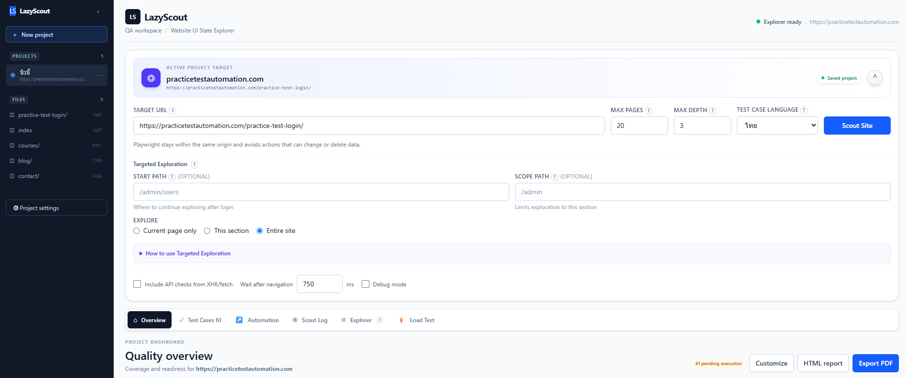

# LazyScout User Guide

> Local-first QA workspace for scouting websites, generating Test Cases, and running Playwright automation.



## Quick navigation

- [Start here](#start-here)
- [Create a Project](#create-a-project)
- [Scout a website](#scout-a-website)
- [What Scout can and cannot reach](#what-scout-can-and-cannot-reach)
- [Login and continue after authentication](#login-and-continue-after-authentication)
- [Review Test Cases](#review-test-cases)
- [Run Automation](#run-automation)
- [Test API](#test-api)
- [Bug Reports](#bug-reports)
- [Export](#export)
- [Troubleshooting](#troubleshooting)

## Start here

The published CLI serves the API and the UI together:

```bash
npx lazyscout@latest
```

It opens `http://localhost:4321` and moves to the next free port if that one is taken. Install the browser once before your first Scout:

```bash
npx playwright install chromium
```

To work on LazyScout itself, run the two dev processes in separate terminals:

```powershell
npm.cmd run dev:server   # API on 127.0.0.1:4000
npm.cmd run dev:web      # Vite on http://localhost:5173, proxies /api
```

LazyScout stores projects and evidence locally under `~/LazyScout`. Use a separate Project for each website or environment.

## Create a Project

Choose **New project**, enter the Target URL, and select the Test Case Language. A new Project starts empty; Scout it before Project Settings becomes available.

## Scout a website

1. Enter the Target URL.
2. Choose Max pages (1–20) and Max depth (0–3).
3. Choose English or ไทย for generated Test Case content.
4. Optionally enable **Include API checks from XHR/fetch**.
5. Press **Scout Site**.

If the Project already contains data, LazyScout shows a confirmation modal before replacing the discovered result.

Scout runs as a single request and can take a while — a 2-page crawl of the bundled demo site takes about 25 seconds, because every discovered control is tried with its own timeout. Pressing Stop takes effect at the next state boundary rather than instantly.

## What Scout can and cannot reach

Scout follows same-origin links **and clicks** discovered navigation items, tabs, accordions and dialog triggers to map UI states. It never fills or submits a form.

Two behaviours explain most "why did it only find a few pages?" questions:

**Login-looking URLs stop a branch.** Any path containing `/login`, `/signin` or `/auth` is treated as a lost session, and the action that led there is rolled back — even if you were never signed in. Anything reachable only through a login link stays undiscovered.

**Failed actions retry twice, then are skipped.** They appear in the Scout Log as `Failed: <name>` and as `failed` edges in the Explorer, and the run continues.

On the bundled 9-page demo site (`node fixtures/serve.mjs`, then Scout `http://localhost:5500`), an unauthenticated Scout finds **2 pages** and generates about 27 Test Cases. Signing in first, and setting a Start Path, is what unlocks the rest.

Nothing is blocked as "destructive" until you configure a click filter in Project Settings. The built-in keyword list is a suggestion offered by the UI, not an enforced policy.

## Login and continue after authentication

1. Open **Project Settings** and press **Open login browser**.
2. Sign in manually.
3. Press **Capture session**. LazyScout waits for the sign-in to stop changing the browser's storage, then saves a snapshot.
4. Press **Verify** against a protected path such as `/dashboard`. The status becomes **ready** only when that page actually opens.
5. Scout the Project, or run a Test Case, with **Start Path** set past the sign-in page.

The snapshot is a Playwright `storageState`: every cookie — including the session cookies that have no expiry — plus localStorage, IndexedDB where the installed Playwright supports it, and sessionStorage captured separately. It is stored at `projects/<id>/auth/storage-state.json`, readable only by you, and ignored by Git.

This matters because a Chromium profile directory is not enough on its own. Session cookies live in memory and are gone the moment the browser closes, and most applications keep their refresh token in exactly that kind of cookie — which is why reusing a profile alone would land a run back on the sign-in page.

Keep the host consistent: `localhost` and `127.0.0.1` are different browser origins.

### What the status means

| Status           | Meaning                                                      |
| ---------------- | ------------------------------------------------------------ |
| `not-configured` | No session has been recorded                                 |
| `recorded`       | A snapshot exists but has not been proven to work            |
| `verifying`      | A sign-in window is open, or a check is running              |
| `ready`          | A protected page opened with the snapshot restored           |
| `expired`        | The snapshot no longer authenticates; record the login again |
| `invalid`        | The snapshot could not be used at all                        |

A directory existing has never meant a working login, and the status no longer implies it.

### One run at a time

An application that rotates refresh tokens issues a new one and revokes the old on every use, so two runs sharing one snapshot sign each other out — and a server that notices the reuse may revoke the whole token family. LazyScout therefore locks the Project's session while a Scout, a recording or a Test run is using it, and refuses the second one with a clear message rather than letting both corrupt the session.

### Browser mode

Signing in, recording, scouting and running all use the same browser mode, because an application that ties a session to the browser it was issued to will reject a session captured in a different one. Set `LAZYSCOUT_HEADED=1` to run everything visibly. When a snapshot was captured in a different mode from the current one, the status reports `browserModeMismatch`.

Use **Scope Path** to keep a large application's crawl inside one section, such as `/admin`.

## Review Test Cases

The Test Cases table shows ID, folder, title, type, priority, steps, expected result, automation readiness, and execution status.

Generated cases are drafts. Review credentials, destructive actions, and expected behaviour before running. Cases marked `needs-review` carry a note explaining what the generator could not infer — most often a business rule that the HTML does not expose.

## Run Automation

Open **Automation**, select a Test Case, and press **Run**. LazyScout writes the Test Case's Playwright source to a temporary spec file and runs it with the real `@playwright/test` CLI, streaming the CLI output into the log.

> The code shown in the editor is the code that will execute, unsandboxed, with your user's privileges. Read it before pressing Run. See [SAFETY.md](SAFETY.md#4-automation-runner).

Use **Run selected cases** to run only the checked cases. Run limits: 100 steps, 200,000 characters of source, 20 seconds per action, 250 log lines. Cypress is code generation only — the runner reports `unsupported`.

Screenshots appear in the Gallery only when the code calls `page.screenshot()`.

## Test API

Enable API collection during Scout to see observed XHR/fetch requests. GET, HEAD and OPTIONS can be checked directly. POST, PUT, PATCH and DELETE stay observation-only.

## Bug Reports

When an automation run fails, LazyScout creates a Bug Report draft linked to the Test Case. Review actual result, expected result, reproduction steps, severity, and screenshots before sharing it with the team.

## Export

**Export CSV** produces one UTF-8 file with two sections — Test Cases, then a `"TEST DATA"` header and the Test Data rows. The Test Case columns are:

```
TC_ID, Folder, Title, Type, Priority, Test_Steps, Expected_Result,
Automation_Status, Preconditions, Notes, Tags, Module, Requirements, Source_URL
```

The same CSV is written into the Project folder on every save, alongside `test-cases.json` and `test-data.csv`. Click **Local workspace** in the sidebar to open the folder.

The CLI can produce the same output without the UI:

```bash
npx lazyscout scan http://localhost:5500 --csv report.csv --json raw.json
```

Raw JSON may contain internal URLs, page labels and observed API metadata. Review it before sharing.

## Troubleshooting

### A run lands back on the sign-in page

Check **Project Settings → session status**. `expired` means the snapshot no longer authenticates: record the login again. `ready` with the run still failing usually means the application rotates its refresh token — see the limitation below.

### A recorded login Test Case cannot be replayed

A login flow has to start signed out, but a Project with a saved session starts signed in, so the application redirects past the sign-in form and the recorded fill steps find nothing. Clear the session first with **Clear login session**, or keep login Test Cases in a Project that has no saved session.

### Scout only found one page

Check the Scout Log. If it ends with an error and the summary says `browser-crash`, that name is a catch-all for any failure inside the crawl — the real reason is in the reported issue. If the log shows `Auth lost after action`, the branch hit a `/login`, `/signin` or `/auth` URL; use the authenticated workflow above.

### The page stays on Login

Use the same URL host for Login and Scout, close the login browser before scouting, and make sure the Project profile is not locked by another LazyScout browser.

### Port 4000 is already in use

Another LazyScout server is running. Stop it, or start yours on a different port with `PORT=4100 npm.cmd run dev:server`. The packaged CLI picks the next free port automatically; the dev server does not.

### Scout finds no useful controls

Check Scout Log for Cloudflare, authentication, delayed rendering, or a page that exposes no accessible controls.

### A generated test fails immediately with a Playwright API error

Regenerate the code after updating LazyScout. Some older generated sources were saved with an assertion that the installed Playwright version rejects.
